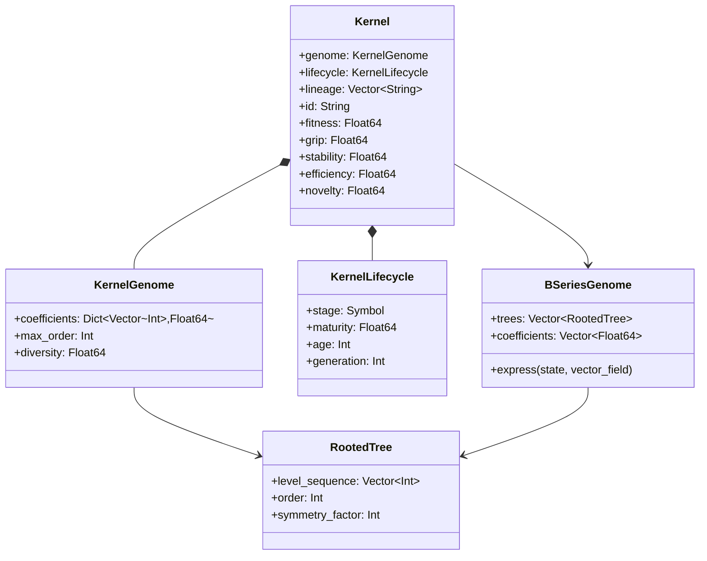

# CogPilot.jl - Technical Architecture Documentation

## Executive Summary

CogPilot.jl is a unified cognitive architecture for computational intelligence implemented in Julia. The system integrates multiple computational paradigms—Echo State Networks, B-Series computational methods, P-System membrane computing, and rooted tree algebras—into a comprehensive framework orchestrated by an ontogenetic engine driven by the OEIS A000081 sequence.

**Key Technologies:**
- **Language:** Julia 1.10+
- **Paradigm:** Scientific machine learning, symbolic-numeric computing
- **Architecture:** Layered cognitive computing system
- **Mathematical Foundation:** Rooted trees, B-series, symplectic geometry
- **Ecosystem:** SciML (Scientific Machine Learning) ecosystem

---

## System Architecture Overview

### High-Level Architecture

### Component Interaction Architecture

---

## Data Flow Architecture

### Primary Data Flow

### Kernel Evolution Cycle

---

## Integration Boundaries

### External System Integration

### Component Dependency Graph

---

## Module Architecture

### DeepTreeEcho Module Structure

### Kernel Genome Structure

---

## System State Model

### State Representation

### Kernel Lifecycle States

---

## Deployment Architecture

### Development Environment

### Production Deployment Scenarios

---

## Performance Characteristics

### Computational Complexity

| Component | Time Complexity | Space Complexity | Parallelizable |
|-----------|----------------|------------------|----------------|
| A000081 Tree Generation (order n) | O(a(n)) | O(Σa(i) for i≤n) | Partially |
| B-Series Evaluation | O(n·t) | O(t) | Yes |
| Echo State Reservoir Update | O(N²) | O(N²) | Yes |
| J-Surface Gradient Flow | O(N) | O(N) | Yes |
| Membrane Evolution Step | O(m·r) | O(m·s) | Yes |
| Kernel Fitness Evaluation | O(k·f) | O(k) | Yes |
| Cross-Pollination | O(t²) | O(t) | Partially |

Where:
- a(n) = A000081[n] (grows exponentially: ~C·ρⁿ/n^(3/2) where ρ≈2.955...)
- t = number of rooted trees
- N = reservoir size
- m = number of membranes
- r = number of rewriting rules
- s = multiset size
- k = number of kernels
- f = fitness evaluation cost

### Scalability Profile

---

## Security Considerations

### Data Flow Security

1. **Input Validation**
   - Tree structure validation (valid level sequences)
   - Parameter range checking (A000081 alignment)
   - Type safety through Julia's type system

2. **State Integrity**
   - Immutable data structures where appropriate
   - Invariant checking in critical operations
   - Numerical stability monitoring

3. **Resource Management**
   - Memory bounds for tree generation
   - Computation timeouts for evolution loops
   - Graceful degradation on resource exhaustion

### Threat Model

- **Not Applicable:** Network security (pure computational library)
- **Not Applicable:** User authentication (scientific computing context)
- **Relevant:** Numerical stability and precision
- **Relevant:** Resource exhaustion (exponential tree growth)
- **Relevant:** Deterministic reproducibility (random seed management)

---

## Technology Stack Summary

### Core Technologies

| Layer | Technology | Purpose | Version |
|-------|-----------|---------|---------|
| Language | Julia | High-performance scientific computing | 1.10+ |
| Math Foundation | RootedTrees.jl | Tree enumeration and operations | 2.x |
| Numerical Methods | BSeries.jl | B-series expansion | 0.1.x |
| Symbolic Computing | ModelingToolkit.jl | Symbolic-numeric bridge | 10-11.x |
| Differential Equations | DifferentialEquations.jl | ODE/SDE/PDE solving | Latest |
| Reservoir Computing | ReservoirComputing.jl | Echo state networks | 0.11-0.12.x |
| Neural Methods | NeuralPDE.jl | Physics-informed neural nets | Latest |

### Supporting Libraries

- **LinearAlgebra:** Matrix operations, eigenvalues
- **Random:** Stochastic processes, initialization
- **Statistics:** Fitness evaluation, diversity metrics
- **Symbolics.jl:** Symbolic expression manipulation
- **Combinatorics.jl:** Tree enumeration algorithms
- **Latexify.jl:** LaTeX output for mathematical expressions

### Development Tools

- **Testing:** Test.jl, SafeTestsets.jl
- **Documentation:** Documenter.jl
- **Code Quality:** Aqua.jl, JuliaFormatter.jl
- **CI/CD:** GitHub Actions
- **Coverage:** Codecov

---

## Architectural Patterns

### Design Patterns Used

1. **Composite Pattern**
   - Tree structures (rooted trees)
   - Hierarchical membranes
   - Nested gardens

2. **Strategy Pattern**
   - Different B-series methods (RK4, Dormand-Prince, etc.)
   - Various fitness evaluation strategies
   - Multiple integration schemes

3. **Observer Pattern**
   - Visualization callbacks
   - Fitness monitoring
   - Generation history tracking

4. **Factory Pattern**
   - Kernel generation (DomainKernels)
   - Tree creation (OntogeneticEngine)
   - System initialization

5. **Template Method Pattern**
   - Evolution cycle structure
   - Integration step framework
   - Genetic operator pipeline

### Computational Patterns

1. **Iterative Refinement**
   - Kernel evolution through generations
   - Reservoir training via ridge regression
   - Coefficient optimization

2. **Divide and Conquer**
   - Parallel tree generation
   - Independent membrane evolution
   - Distributed fitness evaluation

3. **Dynamic Programming**
   - Tree enumeration caching
   - Memoized elementary differentials
   - Reusable computation graphs

4. **Pipeline Processing**
   - Input → Reservoir → Integration → Output
   - Tree → Genome → Kernel → Fitness
   - Generation → Selection → Breeding → Mutation

---

## Future Architecture Considerations

### Planned Extensions

1. **GPU Acceleration**
   - CUDA.jl integration for reservoir dynamics
   - GPU-accelerated gradient flow
   - Parallel kernel evaluation

2. **Distributed Computing**
   - MPI.jl for multi-node evolution
   - Distributed tree generation
   - Federated learning capabilities

3. **Advanced Visualizations**
   - Real-time 3D J-surface plots
   - Interactive membrane topology
   - Evolution trajectory animations

4. **Model Export**
   - ONNX export for trained kernels
   - SciML surrogate model generation
   - Standalone solver compilation

### Research Directions

1. **Quantum Integration**
   - Quantum-classical hybrid kernels
   - Quantum tree enumeration
   - Quantum annealing for optimization

2. **Neurosymbolic Computing**
   - Deeper ModelingToolkit integration
   - Learned symbolic expressions
   - Neural-guided tree search

3. **Biological Modeling**
   - Catalyst.jl integration for reaction networks
   - Cell signaling pathway modeling
   - Systems biology applications

4. **Cognitive Architectures**
   - Memory consolidation mechanisms
   - Attention and metacognition
   - Self-referential kernel systems

---

## Glossary

**A000081 Sequence:** OEIS sequence counting unlabeled rooted trees with n nodes: 1, 1, 2, 4, 9, 20, 48, 115, 286, 719, ...

**B-Series:** Formal series expansion for numerical integration methods using rooted trees as basis elements.

**Echo State Network (ESN):** Recurrent neural network with fixed random hidden layer (reservoir) and trained output layer.

**Elementary Differential:** Derivative terms associated with rooted trees in B-series expansions.

**J-Surface:** Geometric structure encoding symplectic or Poisson geometry for gradient-evolution unification.

**Kernel:** Self-evolving computational method with B-series genome.

**Level Sequence:** Compact representation of rooted trees as integer sequences.

**Membrane Computing (P-Systems):** Bio-inspired computing paradigm using hierarchical membranes with multiset rewriting rules.

**Ontogenetic Engine:** System component that generates and manages rooted trees following A000081.

**Symplectic Integration:** Numerical integration preserving symplectic structure (energy conservation).

**Rooted Tree:** Connected acyclic graph with distinguished root node, fundamental to B-series theory.

---

## References

1. **OEIS A000081:** https://oeis.org/A000081
2. **BSeries.jl:** https://github.com/ranocha/BSeries.jl
3. **RootedTrees.jl:** https://github.com/SciML/RootedTrees.jl
4. **SciML Documentation:** https://docs.sciml.ai/
5. **Hairer, E. et al. (1993):** "Solving Ordinary Differential Equations I: Nonstiff Problems"
6. **Butcher, J.C. (2016):** "Numerical Methods for Ordinary Differential Equations", 3rd Edition
7. **Jaeger, H. (2001):** "The Echo State Approach to Analysing and Training Recurrent Neural Networks"
8. **Păun, G. (2000):** "Computing with Membranes", Journal of Computer and System Sciences

---

*Document Version: 1.0*  
*Last Updated: 2025-12-12*  
*Generated for CogPilot.jl Repository Analysis*
